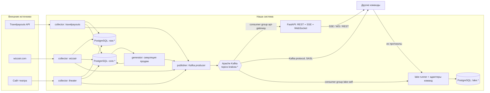

# Архитектура

## Обзор потоков

## Компоненты

### 1. Сборщики (`collectors/`)

Общий базовый класс: `fetch()` → сохранить сырой ответ в `raw.fetch_log` → `parse()` → upsert в `core.*` → вернуть список изменений → publisher отправляет события в Kafka.

| Сборщик | Как | Частота (по умолчанию) | Особенности |
|---|---|---|---|
| `travelpayouts` | httpx, REST, токен из `.env` | каждые 6 ч | Данные из **кэша** поисков пользователей Aviasales, не живые цены. Нет числа мест. Параметр рынка (`market`) влияет на наличие данных. Эндпоинт v3 `prices_for_dates` с `one_way=true`, `destination=KRK`. |
| `wizzair` | Playwright (настоящий браузер), перехват JSON-ответов внутреннего API сайта | каждые 6–12 ч | Сайт защищён от ботов. Сначала — исследование (spike): какие запросы делает сайт, записать ответы в фикстуры. Маршруты в KRK брать из их расписания. |
| `theater` | httpx или Playwright — зависит от системы продажи | программа: раз в сутки; наличие мест: каждые 2–6 ч | Реальные продажи вычисляем из **уменьшения свободных мест** между снимками. |

Список аэропортов отправления — в `config/routes.yaml`, минимум 10 маршрутов в KRK. Горизонт дат — 90 дней (настраивается).

### 2. Генератор (`generator/`)

Работает тиками (по умолчанию каждые 5 мин; есть режим «ускоренного времени» для демо).

- Каждому предложению при первом появлении присваивается **симулированная вместимость** (`seats_total`, напр. 180–230 для A320/A321) и стартовая заполненность.
- На каждом тике: вероятность продажи `p = base_rate × f(дней_до_вылета) × g(цена_относительно_медианы_маршрута)`, `f` растёт к дате вылета.
- Продажа: 1–3 места (одно предложение продаётся многократно).
- Динамическая цена: при пересечении порогов заполненности (50 %, 75 %, 90 %) цена растёт на 3–12 % → событие `price_changed`.
- `seats_left == 0` → `sold_out`; вылет прошёл → `expired`.
- Детерминизм для тестов: `seed` и инъекция времени.
- Генератор **не трогает** сырые данные — только `core.flight_offer` и `core.ticket_sale`.

### 3. Kafka и publisher (`publisher/`)

**Брокер:** Apache Kafka 4.1.0 в режиме **KRaft** (без ZooKeeper), один брокер в docker compose (официальный образ `apache/kafka`). Для просмотра — веб-интерфейс `kafbat/kafka-ui`.

**Топики** (по сущностям, а не по одному на тип события):

| Топик | События | Ключ сообщения | Партиции |
|---|---|---|---|
| `krakow.flights.offers` | `flight.offer.found`, `.observed`, `.price_changed`, `.sold_out`, `.expired` | `offer_id` | 3 |
| `krakow.flights.sales` | `flight.ticket.sold` | `offer_id` | 3 |
| `krakow.theater.performances` | `theater.performance.found`, `.updated` | `performance_id` | 1 |
| `krakow.theater.availability` | `theater.availability.snapshot` | `performance_id` | 1 |
| `krakow.theater.sales` | `theater.tickets.sold` | `performance_id` | 1 |

- **Ключ = id сущности** → все события одного предложения попадают в одну партицию и читаются строго по порядку.
- Тип события дублируется в **заголовке** `event_type` (фильтрация без парсинга тела) и в envelope.
- **Retention:** `retention.ms=-1` (хранить всё весь семестр) — любая команда может подключиться позже и прочитать историю с offset 0. Объём маленький, диск это выдержит.
- Формат значения: JSON (UTF-8) с envelope из `UDALOSTI.md`, проверка по JSON Schema из `schemas/events/` перед отправкой.
- Producer: библиотека **aiokafka**, `acks=all`, `enable_idempotence=True`, сжатие `gzip`.
- Топики создаются кодом при старте (`tools/create_topics.py`), не автосозданием брокера (`auto.create.topics.enable=false`).
- Outbox и Schema Registry **не делаем** (решение: избыточно для проекта). Публикация: запись в `core.event_log`, затем отправка в Kafka; JSON Schema-файлы лежат в репозитории.
- **Бэкап Kafka отдельно не нужен:** свои события хранятся в `core.event_log`, а события других команд — в `lake.message`. Ежедневный бэкап БД покрывает всё; при потере тома Kafka историю можно переиздать из `core.event_log`.

**Доступ для других команд:**
- Два listener'а: `INTERNAL` (внутри docker-сети, без аутентификации) и `EXTERNAL` (публичный адрес, **SASL_SSL + SCRAM-SHA-512**).
- Пользователь `teams`: ACL **только READ** на топики с префиксом `krakow.` и на consumer group с префиксом `team-`. Записывать к нам никто не может.
- Внимание: `advertised.listeners` для внешнего доступа — частая причина «подключается, но не читает». Проверять подключением снаружи, не только из контейнера.

### 4. API и шлюз стрима (`api/`)

Для команд, которым Kafka-клиент неудобен:
- `GET /stream` — **Server-Sent Events**, фильтр `?types=flight.ticket.sold,theater.*`, поддержка `Last-Event-ID` (догрузка из `core.event_log`).
- `WS /ws` — то же по WebSocket.
- Шлюз читает Kafka как consumer group `api-gateway` и раздаёт подключённым клиентам.
- REST (`/api/v1/...`): предложения, история цен, продажи, спектакли, снимки театра, журнал событий с пагинацией. OpenAPI генерирует FastAPI.

### 5. Data lake (`lake/`)

- Для каждой чужой команды — адаптер `lake/adapters/team_XX.py` с общим интерфейсом: подключиться к их источнику (их протокол!) и отдать сообщения writer'у.
- Writer сохраняет **как есть**:
  `lake.message(id, team, channel, received_at, source_ref jsonb, content_type, payload_raw bytea, payload_json jsonb NULL)`.
  `source_ref` — откуда именно: для Kafka `{topic, partition, offset}`, для MQTT `{topic}`, для REST `{url}` и т. п.
  `payload_json` заполняется, только если сообщение — валидный JSON.
- Если команда даёт только БД/REST — адаптер периодически опрашивает и сохраняет снимки.
- Если другая команда тоже на Kafka — адаптер = обычный consumer со своим consumer group; offset коммитится **после** записи в БД (at-least-once; дубли допустимы, их уберёт warehouse по `source_ref`).
- Свои события тоже пишем в lake (consumer group `lake-self`).
- Конфиг: `config/lake_sources.yaml`.

## Схема БД (PostgreSQL)

**`raw`** — всё, что пришло от источников, без изменений
- `raw.fetch_log(id, source, url, request_params jsonb, status_code, fetched_at timestamptz, payload jsonb/bytea, parse_status)`

**`core`** — наши разобранные данные
- `core.flight_offer(offer_id PK, source, origin_iata, destination_iata, departure_at, arrival_at, airline_iata, flight_number NULL, stops, price, currency, seats_total, seats_left, status, first_seen_at, last_seen_at)`
- `core.flight_offer_history(id, offer_id, observed_at, price, seats_left, status, cause)` — `cause`: `scrape` | `generator`
- `core.ticket_sale(sale_id PK, offer_id, quantity, unit_price, total_price, currency, sold_at)`
- `core.theater_performance(performance_id PK, title, stage, starts_at, url, status, first_seen_at, last_seen_at)`
- `core.theater_snapshot(id, performance_id, observed_at, category, price, currency, seats_available)`
- `core.event_log(event_id PK, event_type, topic, occurred_at, payload jsonb)` — всё опубликованное (для REST и `Last-Event-ID`)

**`lake`** — данные других команд: `lake.message` как выше; индексы по `(team, received_at)` и уникальность по `(team, source_ref)` где возможно.

`offer_id` — детерминированный хеш (`sha256` → первые 16 hex) от `source + origin_iata + destination_iata + departure_at (с точностью до минуты, UTC) + airline_iata`. `flight_number` и `fare_key` в хеш **не входят** (у Travelpayouts их часто нет, ключ должен быть стабильным между скрейпами). Следствие: два разных рейса одной авиакомпании на одной минуте на одном маршруте считаются одним предложением; для нашей задачи это допустимо.

## Развёртывание

- `docker-compose.yml`: `postgres` (`postgres:16.15-alpine`), `kafka` (`apache/kafka:4.1.0`, KRaft, 1 брокер), `kafka-ui` (`kafbat/kafka-ui:v1.4.2`), `app` (scheduler: сборщики + генератор + publisher), `api`, `lake`.
- Python 3.12. Playwright — отдельный образ на базе официального образа Playwright для Python.
- Цель: сервер с публичным адресом (Hron/ÚVT или VPS). Наружу: Kafka EXTERNAL listener (SASL_SSL), HTTP API через reverse proxy с HTTPS. `kafka-ui` наружу **не** открывать.

## Почему Kafka (обоснование для презентации)

- **Лог, а не очередь:** сообщения хранятся, а не исчезают после прочтения. Команда, подключившаяся через месяц, читает всю историю с offset 0 — идеально для data lake и будущего warehouse.
- **Replay:** если у потребителя был баг, он сбрасывает offset и перечитывает данные, мы для этого ничего не делаем.
- **Порядок по ключу:** все события одного билета (`offer_id`) в одной партиции → цена и продажи читаются в правильной последовательности.
- **Независимые потребители:** у каждой команды свой consumer group, они не мешают друг другу и нам.
- **Индустриальный стандарт** для стриминга и интеграции данных (Kafka Connect, Debezium, Flink, Spark — всё это знает Kafka).
- **Честно о минусах:** тяжелее RabbitMQ/MQTT, внешний доступ (listeners, SASL, TLS) настраивать сложнее, потребителю нужен Kafka-клиент. Поэтому есть SSE/WebSocket/REST-шлюз — подключиться можно даже через `curl`.
