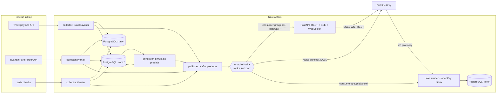

# Architektúra

## Prehľad tokov

## Komponenty

### 1. Zberače (`collectors/`)

Spoločná základná logika: `fetch()` → uložiť surovú odpoveď do `raw.fetch_log` → `parse()` → upsert do `core.*` → vrátiť zoznam zmien → publisher pošle udalosti do Kafky.

| Zberač | Ako | Frekvencia (predvolená) | Osobitosti |
|---|---|---|---|
| `travelpayouts` | httpx, REST, token z `.env` | každých 6 h | Dáta z **cache** vyhľadávaní používateľov Aviasales, nie živé ceny. Chýba počet miest. Parameter trhu (`market`) ovplyvňuje dostupnosť dát. Endpoint v3 `prices_for_dates` s `one_way=true`, `destination=KRK`. |
| `ryanair` | httpx, verejné Fare Finder API (`/api/farfnd/v4/oneWayFares`), bez tokenu | každých 12 h (celý prechod ≈ 30 min) | API vracia jednu najlacnejšiu priamu cenu na okno dátumov, preto jeden dopyt na letisko a deň (`From = To`), pauza 1,5 s. Čas odletu je lokálny, bez posunu: časové pásmo sa berie z oficiálneho zoznamu trás KRK. Chýba počet miest. Pri sérii chýb za sebou sa beh ukončí (znak blokácie). Podrobnosti: `docs/zdroje/ryanair.md`. Wizz Air bol zamietnutý: interaktívna kontrola „či ste človek“ (`docs/zdroje/wizzair.md`). |
| `theater` | httpx; interné dopyty webu Teatr im. J. Słowackiego: program `POST /ajax/pl/repertoireList`, miesta `GET /sbLocationService/forSale.json` (podrobnosti: `docs/zdroje/divadlo.md`) | program: raz denne; dostupnosť miest: každé 2–6 h | Reálny predaj počítame zo **zmeny počtu voľných miest** podľa kategórií `(názov, cena)` medzi snímkami (nárast = vrátenie, záporné množstvo). Vypredané predstavenia v programe bez odkazu na pokladňu sa tiež ukladajú (`sold_out`). Ceny v PLN, plus `price_eur` podľa kurzu ECB (`core.fx_rate`). Cudzie podujatia a uzavreté predstavenia sa preskakujú. Do `raw.fetch_log` sa pri miestach ukladá kompaktný súhrn (legenda, počet miest), nie celá mapa sály: inak ≈100 MB denne. |

Zoznam letísk odletu je v `config/routes.yaml` (Travelpayouts) a `config/routes_ryanair.yaml` (kandidáti, pri každom spustení sa prekrývajú s oficiálnym zoznamom trás Ryanairu), minimálne 10 trás do KRK. Oba zberače berú iba priame lety. Horizont dátumov je 90 dní (nastaviteľné).

### 2. Generátor (`generator/`)

Beží v tikoch (predvolene každých 5 min; existuje režim „zrýchleného času“ pre demo).

- Každej ponuke sa pri prvom výskyte priradí **simulovaná kapacita** (`seats_total`: 180, 186, 189, 195, 215 alebo 230 miest, najčastejšie 189) a počiatočná obsadenosť (tá sa nepočíta ako predaj, je to stav pred naším prvým pozorovaním).
- Každá ponuka má náhodnú **popularitu** (lognormálne rozdelenie so `seed`om, parameter `GENERATOR_POPULARITY_SIGMA`): väčšina ponúk sa predáva málo, malá časť výrazne, takže sa spúšťajú aj cenové prahy.
- V každom tiku: pravdepodobnosť predaja `p = base_rate × popularita × f(dni_do_odletu) × g(cena_voči_mediánu_trasy)`, pričom `f = 0,25 + 2·exp(−dni/25)` rastie k dátumu odletu a `g = medián/cena` (obmedzené na 0,4–2,5) je vyššie pri lacnejšej ponuke. `base_rate` (`GENERATOR_BASE_RATE`, predvolene 0,004) je pravdepodobnosť na 5-minútový tik a škáluje celkový objem.
- Predaj: 1–3 miesta (jedna ponuka sa predáva viackrát).
- Dynamická cena: pri prekročení prahov obsadenosti (50 %, 75 %, 90 %) cena rastie o 3–12 % → udalosť `price_changed` (`reason=load_factor`). Cena zo zdroja (`core.flight_offer.price`) ostáva tak, ako ju zberač zistil; prirážka generátora je osobitne v `price_markup` (≥ 1) a predajná cena je `price × price_markup`. Vďaka tomu zber neprepisuje generátor a naopak (v `flight.offer.observed` je cena zo zdroja, v `flight.ticket.sold` predajná cena).
- `seats_left == 0` → `sold_out`; odlet uplynul → `expired`.
- Determinizmus pre testy: `seed` a injekcia času. Náhodnosť sa odvodzuje zo seedu a id ponuky/času, nie z poradia spracovania: rovnaký seed + rovnaký stav DB + rovnaké časy = rovnaké udalosti.
- Zrýchlený čas: pri `speedup` X simuluje jeden reálny tik `tick-seconds × X` sekúnd, rozdelených na 5-minútové podtiky. `--fast` nečaká medzi tikmi.
- Generátor sa **nedotýka** surových dát, iba `core.flight_offer` a `core.ticket_sale`.

### 3. Kafka a publisher (`publisher/`)

**Broker:** Apache Kafka 4.1.0 v režime **KRaft** (bez ZooKeepera), jeden broker v docker compose (oficiálny image `apache/kafka`). Na prezeranie slúži webové rozhranie `kafbat/kafka-ui`.

**Topiky** (podľa entít, nie jeden na typ udalosti):

| Topik | Udalosti | Kľúč správy | Partície |
|---|---|---|---|
| `krakow.flights.offers` | `flight.offer.found`, `.observed`, `.price_changed`, `.sold_out`, `.expired` | `offer_id` | 3 |
| `krakow.flights.sales` | `flight.ticket.sold` | `offer_id` | 3 |
| `krakow.theater.performances` | `theater.performance.found`, `.updated` | `performance_id` | 1 |
| `krakow.theater.availability` | `theater.availability.snapshot` | `performance_id` | 1 |
| `krakow.theater.sales` | `theater.tickets.sold` | `performance_id` | 1 |

- **Kľúč = id entity** → všetky udalosti jednej ponuky skončia v jednej partícii a čítajú sa v presnom poradí.
- Typ udalosti sa duplikuje v **hlavičke** `event_type` (filtrovanie bez parsovania tela) aj v envelope.
- **Retencia:** `retention.ms=-1` (uchovať všetko počas celého semestra): ktorýkoľvek tím sa môže pripojiť neskôr a prečítať históriu od offsetu 0. Objem je malý, disk to zvládne.
- Formát hodnoty: JSON (UTF-8) s envelope z `UDALOSTI.md`, pred odoslaním kontrola podľa JSON Schema zo `schemas/events/`.
- Producer: knižnica **aiokafka**, `acks=all`, `enable_idempotence=True`, kompresia `gzip`.
- Topiky sa vytvárajú kódom pri štarte (`tools/create_topics.py`), nie automatickým vytváraním brokerom (`auto.create.topics.enable=false`).
- Outbox a Schema Registry **nerobíme** (rozhodnutie: pre projekt je to zbytočné). Publikovanie: validácia podľa JSON Schema, zápis do `core.event_log` (`published_at = NULL`), potom odoslanie do Kafky v poradí `seq`; po potvrdení brokerom sa nastaví `published_at`. Ak Kafka nie je dostupná, udalosti zostanú v `event_log` a odošlú sa pri ďalšom behu (minimálna poistka, nie plný outbox). Súbory JSON Schema sú v repozitári (`schemas/events/`), kontrakt je aj v `docs/asyncapi.yaml`.
- **Zálohu Kafky netreba osobitne:** vlastné udalosti sú v `core.event_log` a udalosti iných tímov v `lake.message`. Denná záloha DB pokrýva všetko; pri strate zväzku Kafky sa história dá znova vydať z `core.event_log`.

**Prístup pre ostatné tímy:**
- Dva listenery: `INTERNAL` (vo vnútri docker siete, bez autentifikácie) a `EXTERNAL` (verejná adresa, **SASL_SSL + SCRAM-SHA-512**).
- Používateľ `teams`: ACL **iba READ** na topiky s prefixom `krakow.` a na consumer groupy s prefixom `team-`. Zapisovať k nám nemôže nikto.
- Pozor: `advertised.listeners` pre externý prístup je častá príčina „pripojí sa, ale nečíta“. Overovať pripojením zvonku, nielen z kontajnera.

### 4. API a brána streamu (`api/`)

Pre tímy, ktorým je Kafka klient nepohodlný:
- `GET /stream` — **Server-Sent Events**, filter `?types=flight.ticket.sold,theater.*`, podpora `Last-Event-ID` (doťahovanie z `core.event_log`).
- `WS /ws` — to isté cez WebSocket.
- Brána číta Kafku ako consumer group `api-gateway` a rozdáva pripojeným klientom. `id` v SSE je `seq` z `core.event_log`; pri pripojení s `Last-Event-ID` sa najprv dobehne história z `event_log` a potom sa pokračuje živým prúdom bez medzier a duplicít (duplicity sa filtrujú podľa `seq`). Príliš pomalý klient sa odpojí (nahrá sa cez `Last-Event-ID`). Spojenie drží komentár `: keepalive` každých 15 s. Súčasť: `/health` a `/api/v1/stats`.
- REST (`/api/v1/...`): ponuky, história cien, predaje, predstavenia, snímky divadla, žurnál udalostí so stránkovaním. OpenAPI generuje FastAPI.

### 5. Data lake (`lake/`)

- Pre každý cudzí tím je adaptér `lake/adapters/team_XX.py` so spoločným rozhraním: pripojiť sa k ich zdroju (ich protokolom!) a odovzdať správy writeru.
- Writer ukladá **tak, ako je**:
  `lake.message(id, team, channel, received_at, source_ref jsonb, content_type, payload_raw bytea, payload_json jsonb NULL)`.
  `source_ref` je presný pôvod: pre Kafku `{topic, partition, offset}`, pre MQTT `{topic}`, pre REST `{url}` a pod.
  `payload_json` sa vypĺňa len vtedy, ak je správa platný JSON.
- Ak tím poskytuje iba DB/REST, adaptér ho pravidelne dopytuje a ukladá snímky.
- Ak je iný tím tiež na Kafke, adaptér = bežný consumer s vlastnou consumer group; offset sa commituje **po** zápise do DB (at-least-once; duplicity sú prípustné, odstráni ich warehouse podľa `source_ref`).
- Vlastné udalosti ukladáme do lake tiež (consumer group `lake-self`).
- Konfigurácia: `config/lake_sources.yaml` (typy `kafka`, `sse`, `ws`, `rest`, `custom`; prihlasovacie údaje iba cez `.env`). Runner reštartuje spadnutý adaptér s exponenciálnym backoffom a jeden rozbitý zdroj nezhodí ostatné. Postup pre nový tím: `docs/timy/README.md`; štatistika: `tools/lake_stats.py`.

## Schéma DB (PostgreSQL)

**`raw`** — všetko, čo prišlo zo zdrojov, bez zmien
- `raw.fetch_log(id, source, url, request_params jsonb, status_code, fetched_at timestamptz, payload jsonb/bytea, parse_status)`

**`core`** — naše spracované dáta
- `core.flight_offer(offer_id PK, source, origin_iata, destination_iata, departure_at, arrival_at, airline_iata, flight_number NULL, stops, price, currency, seats_total, seats_left, status, first_seen_at, last_seen_at)`
- `core.flight_offer_history(id, offer_id, observed_at, price, seats_left, status, cause)` — `cause`: `scrape` | `generator`
- `core.ticket_sale(sale_id PK, offer_id, quantity, unit_price, total_price, currency, sold_at)`
- `core.theater_performance(performance_id PK, title, stage, starts_at, url NULL, status, repertoire_id NULL, instance_id NULL, location NULL, first_seen_at, last_seen_at)` — `performance_id` = slug pokladne (alebo odvodený pre vypredané), `instance_id` = stabilné id predstavenia na webe divadla, `repertoire_id` = id v predajnom systéme (mapa sály)
- `core.theater_snapshot(id, performance_id, observed_at, category, price, currency, seats_available, price_eur NULL, fx_rate NULL)`
- `core.theater_sale(sale_id PK, performance_id, category, quantity, unit_price, currency, unit_price_eur NULL, fx_rate NULL, detected_from, detected_to)` — `quantity < 0` = vrátenie
- `core.fx_rate(rate_date, currency, per_eur, fetched_at)` — kurzy ECB (1 EUR = N jednotiek meny), aktualizujú sa raz denne podľa potreby
- `core.event_log(event_id PK, seq, event_type, topic, occurred_at, payload jsonb, published_at NULL)` — všetko publikované (pre REST a `Last-Event-ID`); `seq` určuje poradie odoslania, `published_at IS NULL` = ešte neodoslané

**`lake`** — dáta iných tímov: `lake.message` ako vyššie; indexy podľa `(team, received_at)` a jedinečnosť podľa `(team, source_ref)`, kde je to možné.

`offer_id` — deterministický hash (`sha256` → prvých 16 hex) z `source + origin_iata + destination_iata + departure_at (s presnosťou na minútu, UTC) + airline_iata`. `flight_number` a `fare_key` do hashu **nevstupujú** (Travelpayouts ich často nemá, kľúč musí byť stabilný medzi zbermi). Dôsledok: dva rôzne lety jednej aerolínie v tej istej minúte na tej istej trase sa považujú za jednu ponuku; pre našu úlohu je to prijateľné.

## Nasadenie

- `docker-compose.yml`: `postgres` (`postgres:16.15-alpine`), `kafka` (`apache/kafka:4.1.0`, KRaft, 1 broker), `kafka-ui` (`kafbat/kafka-ui:v1.4.2`), `app` (scheduler: zberače + generátor + publisher), `api`, `lake`.
- Python 3.12. Ak divadlo bude potrebovať prehliadač, Playwright sa nainštaluje samostatným image na báze oficiálneho Playwright image pre Python (pre letecké zberače netreba).
- Produkčný variant: `docker-compose.prod.yml` + `Dockerfile` (služby `postgres`, `kafka`, `kafka-init`, `migrate`, `app` = plánovač, `api`, `lake`, `caddy`, `backup`), postup v `docs/NASADENIE.md`.
- Cieľ: server s verejnou adresou (Hron/ÚVT alebo VPS). Von: Kafka EXTERNAL listener (SASL_SSL), HTTP API cez reverse proxy s HTTPS. `kafka-ui` von **neotvárať**.

## Prečo Kafka (zdôvodnenie pre prezentáciu)

- **Log, nie fronta:** správy sa uchovávajú a po prečítaní nezmiznú. Tím, ktorý sa pripojí o mesiac, prečíta celú históriu od offsetu 0, ideálne pre data lake a budúci warehouse.
- **Replay:** ak mal konzument chybu, resetuje offset a prečíta dáta znova, my pre to nemusíme nič robiť.
- **Poradie podľa kľúča:** všetky udalosti jednej letenky (`offer_id`) sú v jednej partícii → cena a predaje sa čítajú v správnom poradí.
- **Nezávislí konzumenti:** každý tím má vlastnú consumer group, neovplyvňujú sa navzájom ani nás.
- **Priemyselný štandard** pre streaming a integráciu dát (Kafka Connect, Debezium, Flink, Spark: to všetko Kafku pozná).
- **Čestne o nevýhodách:** je ťažšia než RabbitMQ/MQTT, externý prístup (listenery, SASL, TLS) sa nastavuje zložitejšie, konzument potrebuje Kafka klienta. Preto existuje SSE/WebSocket/REST brána: pripojiť sa dá aj cez `curl`.
